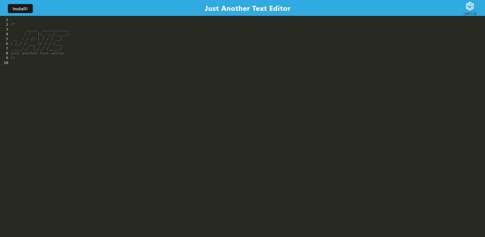

# Text Editor

## Description

Allows user to create and save text both online and offline.

## Table of Contents
- [Installation](#installation)
- [Usage](#usage)
- [License](#license)
- [Contributing](#contributing)
- [Tests](#tests)
- [Questions](#questions)

## Installation

N/A

## Usage

Type any text in the editor, and the text will save automatically. Click the "Install" button the install the application for offline use.

## License

N/A

## Contributing

N/A

## Tests

N/A

## Questions

GitHub Profile: github.com/ETFruitNinja

Email: jeffreyyehuw@gmail.com